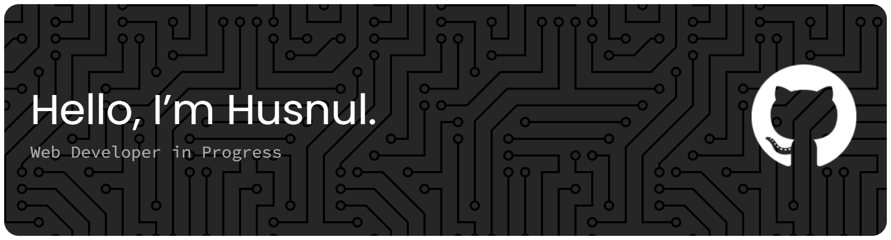

## Skills & Tools

    
  
     

## Connect With me

  

## About Me

- Front-End developer focusing on React and modern JavaScript.
- Currently expanding skills in React, Node.js, and web application development.
- Open to collaboration on React-based and web development projects.
- Contact: husnulf936@gmail.com

###

  
  

###

  

###

<picture>
  <source media="(prefers-color-scheme: dark)" srcset="https://raw.githubusercontent.com/huffyyy/huffyyy/output/pacman-contribution-graph-dark.svg">
  <source media="(prefers-color-scheme: light)" srcset="https://raw.githubusercontent.com/huffyyy/huffyyy/output/pacman-contribution-graph.svg">
  
</picture>

huffyyy/huffyyy is a ✨ special ✨ repository because its `README.md` (this file) appears on your GitHub profile.
You can click the Preview link to take a look at your changes.
--->
